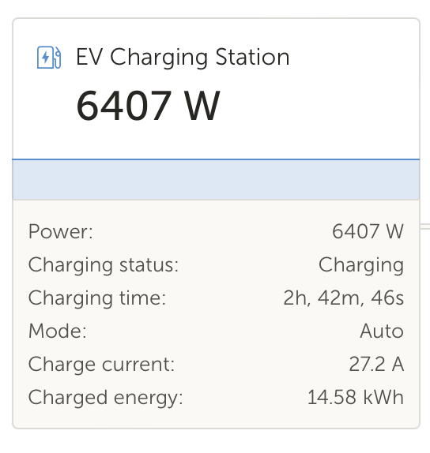
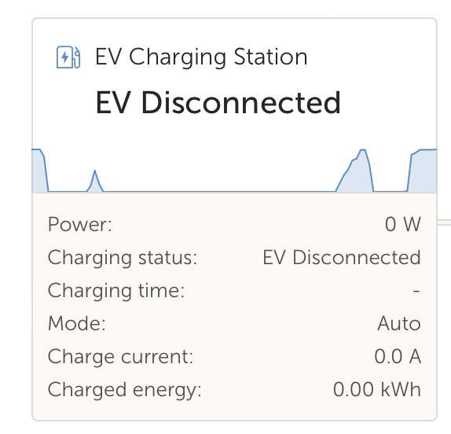

# EVSE to VRM

Get an EVSE to show up on Victron's VRM by using MQTT and a python script. Assumes that the EVSE is already publishing data to an MQTT topic. 

Made this specifically for [APRs EVSE](https://www.missingbolt.com/ev), but with some tweaks could be made to work with other EVSEs.

Does not allow for control of the EVSE from within VRM. For that, I use [NodeRED in VRM Large](https://community.victronenergy.com/questions/73741/venus-os-large-node-red-and-signal-k.html).




## How to set up: 

1. First get ssh access to the Victron Cerbo GX or other device running VenusOS (e.g. Raspberry Pi): https://www.victronenergy.com/live/ccgx:root_access
2. Download all files in this repository to your computer and change evse_to_vrm.py as needed, especially MQTT details: HOST_IP, USER, PASSWORD, TOPIC, etc.
3. Then copy (secure copy - scp) all files in this repository to the directory “/data” in the VenusOS system.

```bash
scp -r /your/local/path/evse_to_vrm/ root@XXX.XXX.XXX.XXX:/data/
```

4. Install paho-mqtt python module in the VenusOS system so that it can read and write to MQTT server.

```bash
pip install paho-mqtt
```

5. Set up file permissions: 

```bash
chmod 755 /data/evse_to_vrm/service/run
chmod 744 /data/evse_to_vrm/restart.sh
chmod 744 /data/evse_to_vrm/uninstall.sh
```

6. Place the service run file in the daemon tools always running files

```bash
ln -s /data/evse_to_vrm/service /service/evse_to_vrm

```
7. Done! The daemon tools should start the service automatically. (if not, reboot the VenusOS device)

If you change the name of the parent directory or the python script or copy them to a different place than /data/evse_to_vrm/evse_to_vrm.py, don't forget to also change the contents of evse_to_vrm/service/run!

### Check the status of the service:

```bash
svstat /service/evse_to_vrm
```

It will show something like this:
/service/evse_to_vrm: up (pid 10078) 325 seconds
If the number of seconds is always 0 or 1 or any other small number, it means that the service crashes and gets restarted all the time.
When you think that the script crashes, start it directly from the command line:

```bash
python /data/evse_to_vrm/evse_to_vrm.py 
```

and see if it throws any error messages.
If the script stops with the message

```bash
dbus.exceptions.NameExistsException: Bus name already exists: com.victronenergy.evcharger.APR_EVSE1"
```

it means that the service is already running or another service is using that bus name. 

### Restart the script

If you want to restart the script, for example after changing it, just run the following command:

```bash
/data/evse_to_vrm/restart.sh
```

### Uninstall

```bash
/data/evse_to_vrm/uninstall.sh
```

## Acknowledgments

Took some ideas and code from:
    - https://github.com/RalfZim/venus.dbus-fronius-smartmeter
    - https://github.com/fabian-lauer/dbus-shelly-3em-smartmeter

Documentation by Victron Energy: 
    - https://github.com/victronenergy/velib_python/blob/master/dbusdummyservice.py
    - https://github.com/victronenergy/venus/wiki/dbus-api

